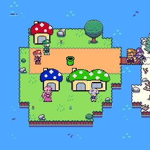

# ECE World

**Theme park game in C with Allegro** — ECE Paris, 1st year engineering team project (2023)


<p align="center">
  
</p>

ECE World is a two-player theme park game built in C with the Allegro
graphics library, as our first-year team project at ECE Paris. It is set
in the Mario universe.

## How it plays

Players walk around a top-down map of the park with the keyboard. Each
building is an attraction: stepping inside launches its mini-game, and
once it's over, the player comes back out and it's the other player's
turn to pick the next ride. The map also works as the game's menu — a
board shows the leaderboard, and the park's exit quits the game.

Every player starts with **5 tickets**. Each attraction costs one, and
winning earns tickets back. When a player runs out, the other one wins.
Best scores for every attraction are saved to a file, so performances can
be compared from one game to the next.

## Attractions

| Attraction | Description | Built by |
| --- | --- | --- |
| **River crossing** | Jump from log to log across a scrolling river without falling in. Log directions are randomized. | Minh-Duc |
| **Koopa shooting** | Shoot flying Koopas with the mouse before they escape. Hit Koopas respawn at random. | Minh-Duc |
| **Goombattack** | Platformer: survive waves of Goombas (3 difficulty levels) with jumps and double jumps, against the clock. | Bastian |
| **Yoshi race** | Each player bets on a Yoshi; speeds change during the race and a correct bet wins a ticket. | Gabriel |

Each team member had to build at least one attraction from scratch.
I built **Goombattack**. The interesting part was collision handling:
instead of hard-coding the platforms, the level uses a hidden collision
layer — a copy of the map painted in flat colors — and the game reads its
pixels to know whether Mario stands on solid ground, hits a wall or lands
a jump, which also made the double jump easy to get right.

## Architecture

The hardest part wasn't the mini-games themselves but making them fit
together: sharing a single event queue and keyboard setup across the
whole game, loading each image only once, and returning cleanly to the
map with the player's results. We designed that architecture before
writing any code, which saved us from a painful merge at the end.

```
main.c             Allegro init, shared assets, game loop
Title Screen/      Title screen and player name input
Hub Scrolling/     Scrolling park map, collisions, attraction detection
Joueur/            Player state (name, tickets, scores)
Classement/        Leaderboard
Game1/             River crossing
Game2/             Koopa shooting
Game3/             Goombattack
Game4/             Yoshi race
Score/             Saved best scores
Images/  Music/    Sprites, maps and sounds
presentation/      Final presentation slides (Marp)
```

## Build and run

The project targets **Windows** with **MinGW** and **Allegro 4.4.2**
(monolith build), and was developed with CLion.

```sh
cmake -S . -B cmake-build-debug -G "MinGW Makefiles"
cmake --build cmake-build-debug
cd cmake-build-debug
./PROJET.exe
```

Run the executable from the build directory: assets are loaded with
paths relative to it (`../Images`, `../Music`, `../Score`).

**Controls:** arrow keys to move, `P` to enter an attraction, `Esc` to
leave a mini-game.

## Team

- [Bastian Ardillon](https://github.com/arbasti)
- [Gabriel Allard](https://github.com/saintGabibi)
- [Minh-Duc Phan](https://github.com/mndfan)
