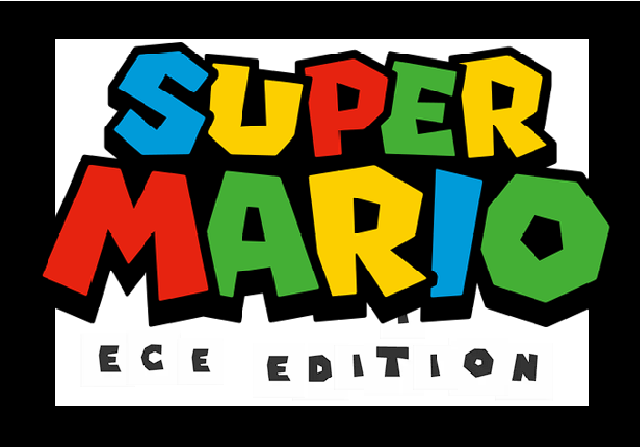
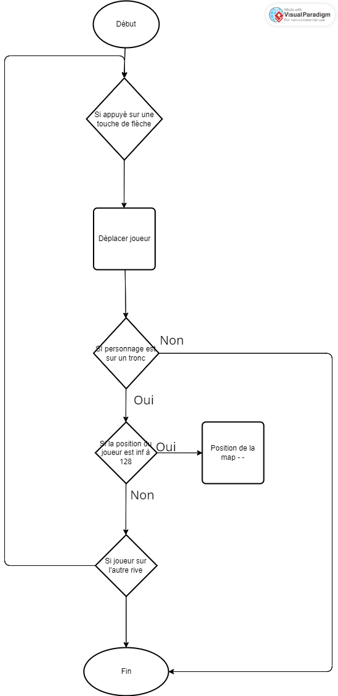
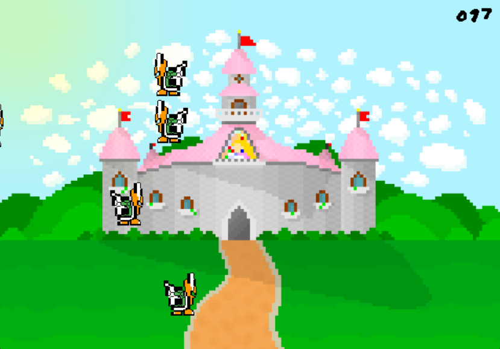
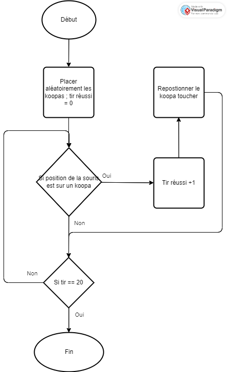
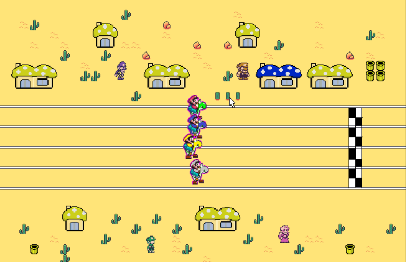
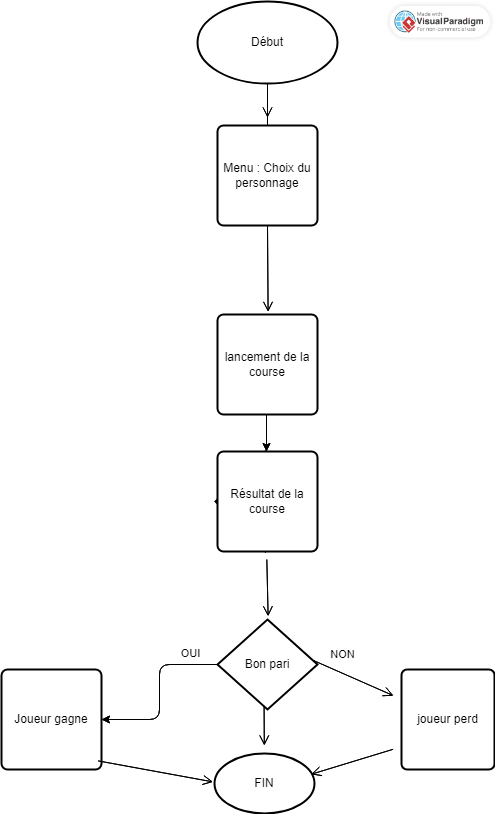

<script type="module">
  import mermaid from 'https://cdn.jsdelivr.net/npm/mermaid@10/dist/mermaid.esm.min.mjs';
    mermaid.initialize({ 
        startOnLoad: true,
        theme: 'base',
    });
</script>

<!--
# Style lead only for this slide
_class: lead
_footer: Algorithmique Avancée et Bibliothèque Graphique - 2022-2023
-->


**ING1** Projet d'informatique


# ECE World

Equipe X

---

# Equipe X


- Bastian Ardillon
- Gabriel Allard
- Minh-Duc Phan

---

# ECE World



## Thème

Pour ce projet, nous avons décidé d'utiliser l'univers de Mario comme thème de notre parc d'attraction. Celle-ci étant variés, ce thème nous permet de pouvoir imaginé de nombreuse façon d'aprehender nos activités comme la course hippique avec des yoshis ou encore du jeu "goombaattack" par exemple

---

# Carte `1/2`

*Réalisée par : **Bastian**, **Gabriel**.*

Pour le nom des joueurs, on prend en compte les touches appuyé par l'utilisateur pour chaque pseudo. Celle-ci sera ensuite utilisé dans le classement qui pourra être consulter sur la carte. 

Le joueur peut choisir l'attraction qu'il souhaite en appuyant sur la touche 'P'. On utilise un buffer qui avec des couleurs permet de voir chaque activité à l'aide d'un getpixel sur ce buffer.

---

# Carte `2/2`

Nous avons eu quelque problème concernant les collisions avec le personnage et nous avons eu une idée sur le changement de skin, malheureusement nous avons abandonné l'idée du à un manque de temps.

---

# Organisation des jeux

Chaque jeu se trouve dans un dossier à leur nom qui seront ensuite appelé dans le programme principale

Celle-ci prend en compte les pointeurs des scores des joueurs, le buffer de l'écran ainsi qu'une musique de fond. 

Lorsque le joueur est sur une attraction, on vérifie s'il appuie sur la touche "P". Tant que le joueur n'aura pas terminé le jeu ou n'appuie pas sur la touche échappe, le jeu continue sinon celui-ci revient sur la carte. Le classement est mise à jour à chaque fois que l'on quitte le parc.


---


# Traversé de la rivière

*Réalisé par : **Minh-Duc**.*

Décrire le fonctionnement du jeu dans les grandes lignes. Comment vous l'avez conçu.
- Les troncs ont une chance aléatoire d'aller vers la droite ou vers la gauche
- Si le joueur va sur un tronc, il est emporté par celui-ci
- Il y a une collision si celui-ci va dans l'eau
- La map continue de scroller quand il atteint un certains points

<sup>:bulb: Remplacez les images par des captures d'écran de votre jeu.</sup>

---


# Traversé de la rivière

### Fonction

- `placement(int j,int i,int pos_x,int pos_y,int imgcourante,BITMAP* sprites[],BITMAP* title)`
- `collision(int * pos_perso_x,const int * pos_perso_y,int pos_x,int pos_x_inv,int pos_y,int j,int i,int direct,int dx)`

---


# Traversé de la rivière

### Fonction

- `out(int * pos_perso_x,const int * pos_perso_y,int pos_x,int pos_x_inv,int pos_y,int j,int i,int direct,int *fin)`

### Tableaux

- `int liste_placement(24)`
- `int liste_inver(24)`
- `int liste_vit(24)`

---


# Traversé de la rivière

### Graphe d'appel

<br>

<div class="mermaid">
%%{init: {'theme':'neutral'}}%%
flowchart LR
    TraversédeRivière --> boisAlea
    boisAlea --> placementBois
    boisAlea --> collisionBois
    TraversédeRivière --> deplacerPerso
    boisAlea --> SortiePerso
</div>


---


# Traversé de la rivière

### Logigramme



---



# Tir aux koopas

*Réalisé par : **Minh-Duc**.*


- Les koopas volent vers le haut et vont aléatoirement à droite ou à gauche
- Si le joueur réussi à toucher un koopa, celui-ci réapparait aléatoirement
- Le joueur ne peut pas maintenir le clique indéfiniment

<sup>:bulb: Remplacez les images par des captures d'écran de votre jeu.</sup>

---


# Tir aux koopas


### Structures

<div class="mermaid">
%%{init: {'theme':'neutral'}}%%
classDiagram
    class koopa_volant
    koopa_volant : int pos_koopa_x
    koopa_volant : int pos_koopa_y
    koopa_volant : int direction
    koopa_volant : int inversion
</div>

### Tableaux

- `koopas_volant liste[MAX_KOOPA]`
- `BITMAP koopa[2]`
- `BITMAP nombre[10]`

---


# Tir aux koopas

### Graphe d'appel

<br>

<div class="mermaid">
%%{init: {'theme':'neutral'}}%%
flowchart LR
    TirauxKoopas --> placement_koopa
    TirauxKoopas --> Tir_koopa
    Tir_koopa --> Toucher_koopa
    TirauxKoopas --> Réinitialisation_pos
    TirauxKoopas --> Fin_jeu
</div>


---


# Tir aux koopas

### Logigramme




---

# Course hyppique


Le menu permet de sélectinner un des Yoshi pour lequel l'on mise (flèche bleue pour le J1 et flèche rouge pour le j2 )
la course : animation sprite sur fond avec une vitesse qui varie tous les 100. x positions
Le permier joureur avec un Yosh.x = ligne d'arrivée. x gagne

Le gagnant est affiché et si l'un des deuxd joeurs a parié dessus alors celui-ci gagne un tickets---
Course hyppique

---


### FONCTION():

- `void course_hyppique_main();`
- `void collision_menu1( BITMAP* fond,  BITMAP* map_collision, BITMAP * fleche_Bleu, int tour, intpari[]  );`
- `void collision_menu2( BITMAP* fond,  BITMAP* map_collision, BITMAP * fleche_Rouge , int pari[] );`
- `void Menu(intpari1, int pari2);`

 ---

 

### FONCTION():

- `void victoire (player yoshi1,player yoshi2,player yoshi3,player yoshi4, BITMAP fond, BITMAP yosh1 ,BITMAP yosh2,BITMAP * yosh3,BITMAP * yosh4, BITMAP page, intgagnant, int pari1[],intpari2[] )`
- `player vitesse_joueur (player yosh)`

 ---

# Course hyppique


### GRAPHE D'APPEL
<br>

<div class="mermaid">
%%{init: {'theme':'neutral'}}%%
flowchart LR
    Coursemain --> Menu
    Menu --> collision1
    Menu --> collision2
    collision1 --> vitessejoueur
    collision2 --> vitessejoueur
    vitessejoueur --> victoire
</div>

---
# Course hyppique

### Logigramme




---

# Bilan collectif

Jeu 80% réussi

difficultées: 

organisation
relier les parties
longueur du projet

points positifs:

liberté d'action
créativité
travail d'équipe
marp 😉


---

<!--
_class: lead
-->

# Les slides suivantes ne seront pas présentées oralement lors de la soutenance mais doivent figurer dans la présentation. Nous les survolerons rapidement.

---

# Minh-Duc

## Tâches réalisées (pour chaque membre de l'équipe)

- `✅ 100%` **Traversé de la rivière**
- `✅ 90%` **Tir aux koopas**
    - *Ajouter le nombre de tir réussi et raté ou de mieux positionner l'apparition des koopas.*
- `❌ 90%` **Classement**
    - *Mettre une sauvergarde pour tous les jeux .*

---


# Gabriel

## Tâches réalisées (pour chaque membre de l'équipe)

- `✅ 100%` **Course hyppique**
- `✅ 30%` **Map**
- `❌ 50%` **Map tuyau**
    - *Nous avons abandonné cette idée de changer le skin du perosnnage.*

---

# Bastian

## Tâches réalisées (pour chaque membre de l'équipe)

- `✅ 100%` **Goombattack**
- `✅ 70%` **Map**
- `❌ 50%` **Map tuyau**
    - *Nous avons abandonné cette idée de changer le skin du perosnnage.*

---

# Investissement

Si vous deviez vous répartir des points, comment feriez-vous ?

<div class="mermaid">
%%{init: {'theme':'neutral'}}%%
pie showData
    "Minh-Duc" : 35
    "Bastian" : 35
    "Gabriel" : 25

</div>

---

# Récapitulatif des jeux

| Jeu | Avancement | Problèmes / reste |
| --- | --- | --- |
| Traversé de la Rivière| 100% | - |
| Tir aux koopas | 100% | - |
| Goombattack | 100% | - |
| Course hyppique | 99% | Problème avec le ticket |


---

<!--
_class: lead
-->
# Quelques éléments que vous pouvez utiliser à votre guise dans votre présentation

---

# Schémas et Graphes

Vous pouvez utiliser [Mermaid.js](https://mermaid.js.org/) pour générer des schémas. Regardez la documentation.

---

# Slide avec du code


```C
for(int i = 0; i < 5; i++) {
    printf("%d ", i);
}
```

> 0 1 2 3 4 


---

# Emojis

https://gist.github.com/rxaviers/7360908

---

# Thème 

Vous pouvez personnaliser l'affichage de votre présentation avec le langage CSS en modifiant le fichier `theme.css`.

---

# Export PDF

Depuis récemment, l'export (**`Export Slide Deck...`**) en PDF oublie parfois des éléments. 
Si c'est le cas, nous vous conseillons d'exporter en fichier PowerPoint (pptx), puis de l'exporter en PDF depuis PowerPoint.